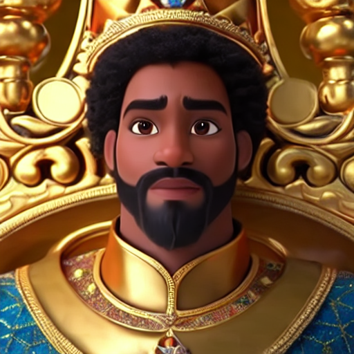
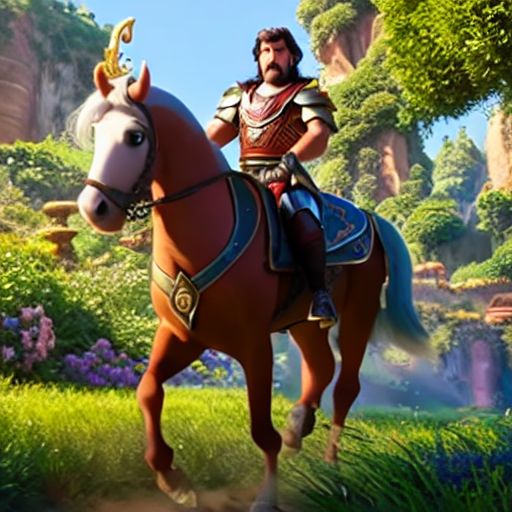
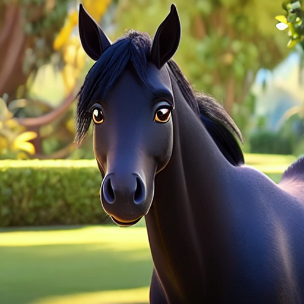
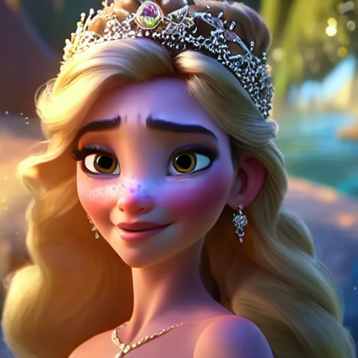
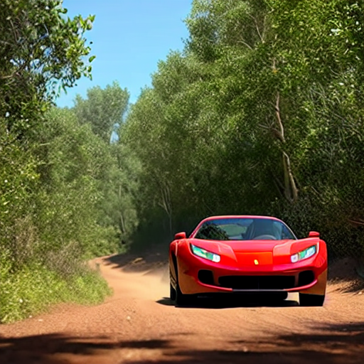

# Cartoonify

This is a dreambooth model derived from `runwayml/stable-diffusion-v1-5` with additional fine-tuning of the text encoder. The weights were trained from a popular animation studio using [DreamBooth](https://dreambooth.github.io/). Use the tokens **_disney style_** in your prompts for the effect.

You can find some example images below:

<p float="left">
    
    
    
    
    
</p>

# Getting started

## Installation

```bash
python -m venv .venv
source .venv/bin/activate
python -m pip install poetry
poetry install
```

## Overview of Codebase

### Scripts

`./tools/train_dreambooth.py` - Fine-tune the model on your own dataset.

`./tools/experiment.py` - Generate images using the model and log metadata such as seed, classifier-free guidance parameter, prompt, negative prompt, etc.

`./tools/rename_images.py` - Rename collected images to unique integer id for ease of use.

### Cartoonify Package

`./src/cartoonify/utils.py` - Utility functions for prediction via Huggingface pipeline.

# Intended uses & limitations

## How to use

```python
import torch
from diffusers import StableDiffusionPipeline

# basic usage
repo_id = "lavaman131/cartoonify"
device = torch.device("cuda")
torch_dtype = torch.float16 if device.type in ["mps", "cuda"] else torch.float32
pipeline = StableDiffusionPipeline.from_pretrained(repo_id, torch_dtype=torch_dtype).to(device)
image = pipeline("PROMPT GOES HERE").images[0]
image.save("output.png")
```

## Limitations and bias

As with any diffusion model, playing around with the prompt and classifier-free guidance parameter is required until you get the results you want. For additional safety in image generation, we use the Stable Diffusion safety checker.

# Data preparation details

The data used for training the model was collected from the internet (namely screenshots taken from YouTube). The images were resized to 512x512 using subject-preserving cropping from [here](https://www.birme.net/) and saved. The images were then renamed to unique integer ids using the `./tools/rename_images.py` script. The full dataset can be found [here](https://huggingface.co/datasets/lavaman131/pixar-images).

# Training details

The model was fine-tuned for 3500 steps on around 200 images of modern Disney characters, backgrounds, and animals. The ratios for each class were 70%, 20%, and 10% respectively on an RTX A5000 GPU (24GB VRAM).

A report on the training process can be found [here](https://api.wandb.ai/links/lavaalex/5zagq2tk).

The training code used can be found [here](https://github.com/huggingface/diffusers/blob/main/examples/dreambooth/train_dreambooth.py). The regularization images used for training can be found [here](https://github.com/aitrepreneur/SD-Regularization-Images-Style-Dreambooth/tree/main/style_ddim).
